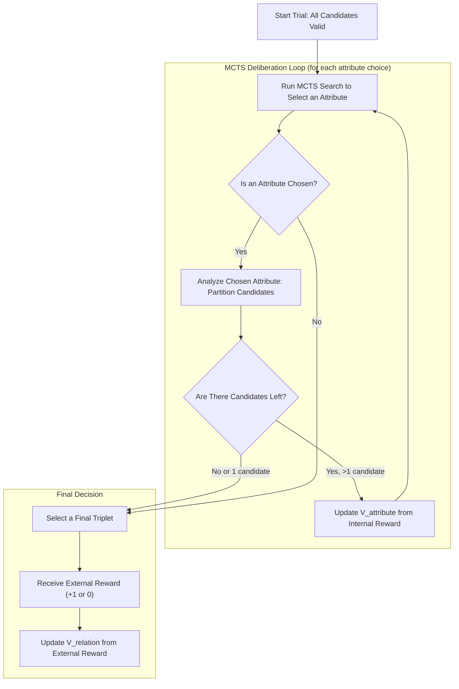
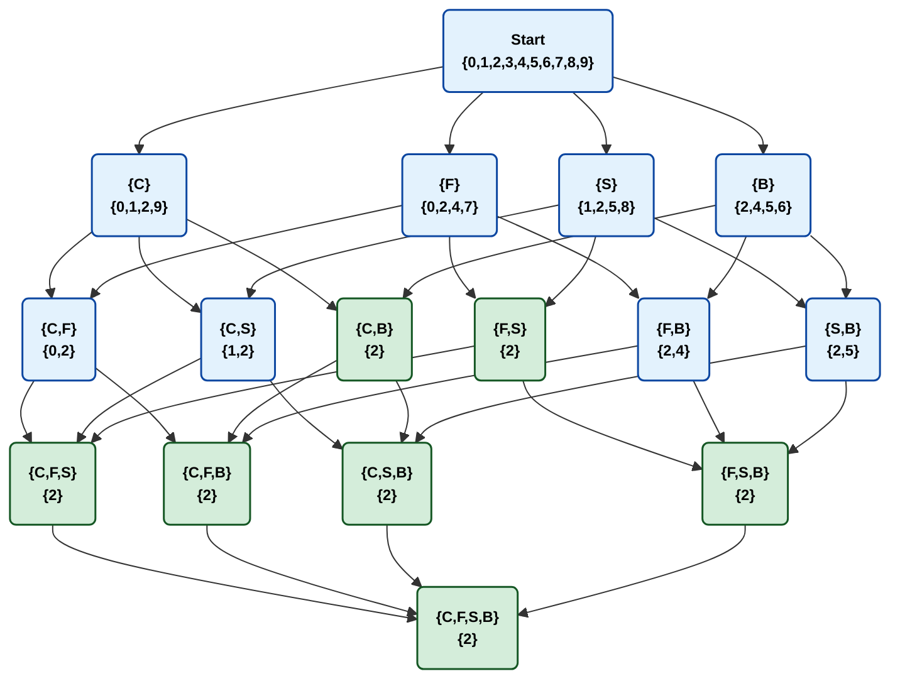
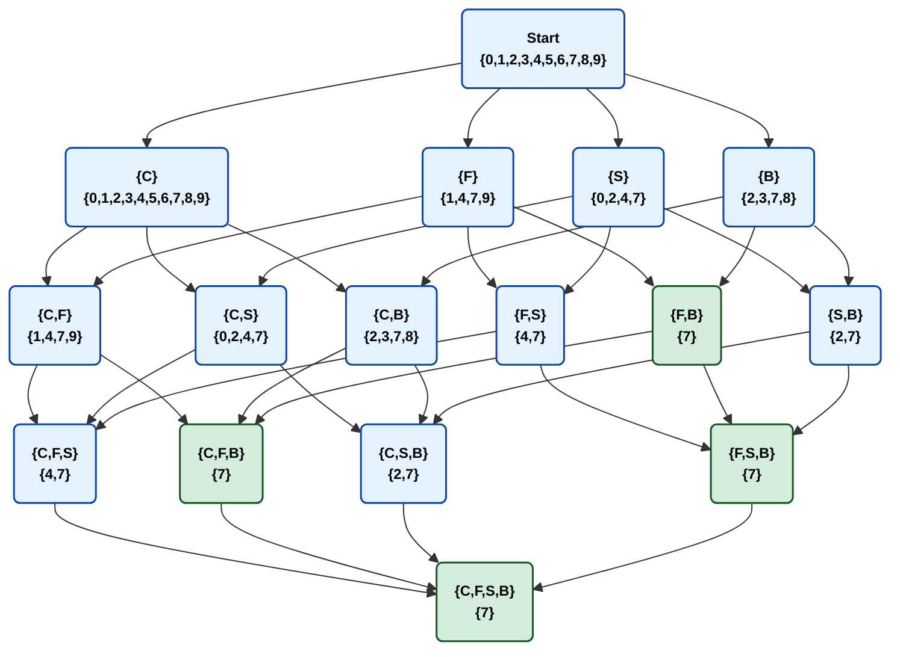
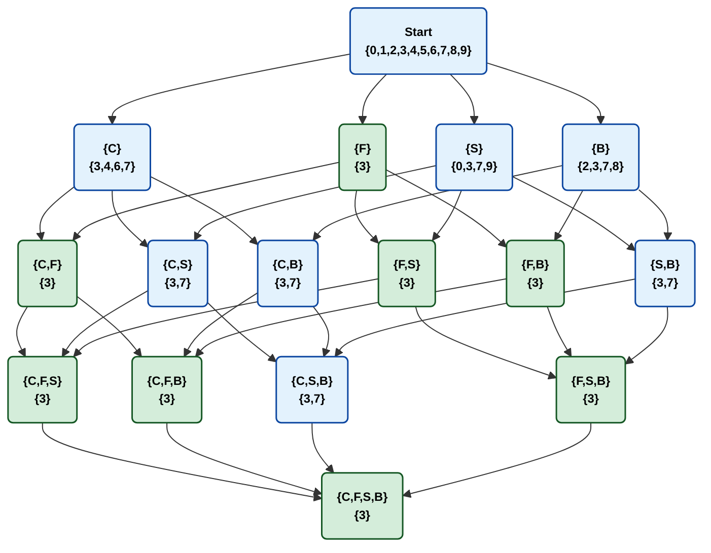
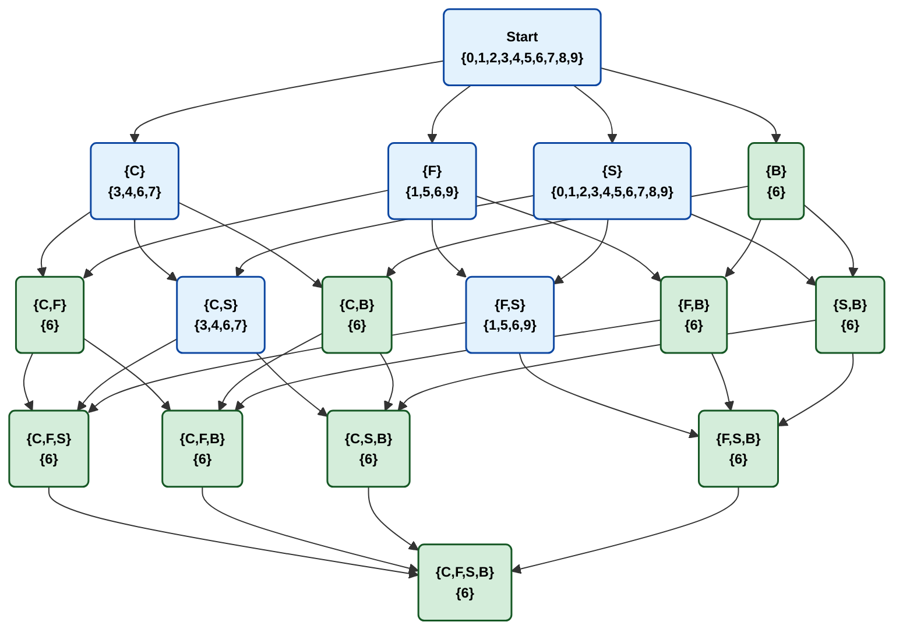
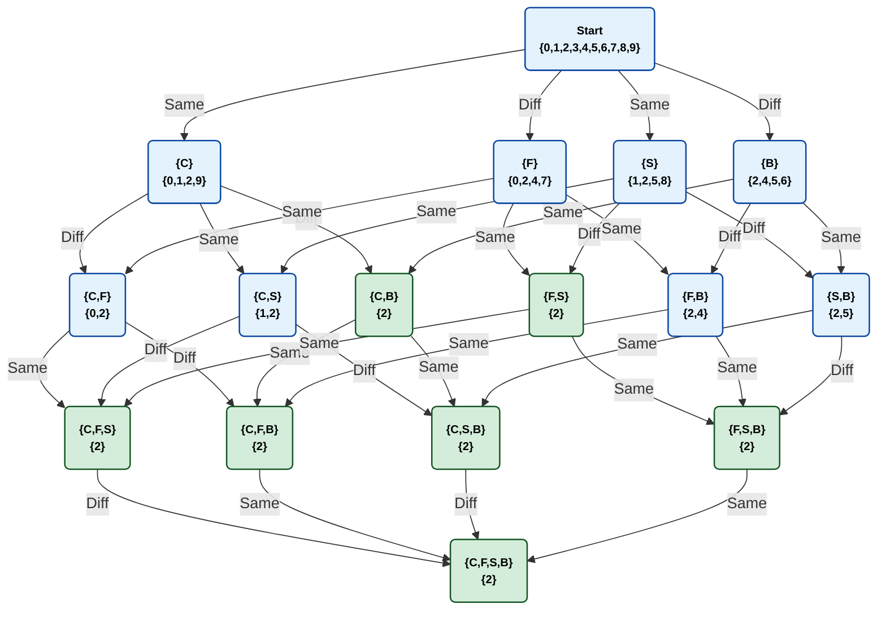

## Getting Started

Follow these instructions to set up the necessary Python environment and run the simulations. This project uses `conda` for environment management to ensure all dependencies, including those with compiled code, are handled correctly.

### Prerequisites

You must have a Conda installation on your system. You can get it by installing either:

-   **Anaconda:** A full-featured distribution including Conda and many common packages.
-   **Miniconda:** A minimal installer for Conda. (Recommended if you prefer a lightweight setup).

You can find installers on the [official Conda website](https://conda.io/projects/conda/en/latest/user-guide/install/index.html).

### Installation

The entire environment can be created from the `environment.yml` file.

1.  **Clone the Repository (if you haven't already):**
    ```bash
    git clone [https://github.com/your-username/your-repository-name.git](https://github.com/your-username/your-repository-name.git)
    cd your-repository-name
    ```

2.  **Create the `environment.yml` file:**
    In the root directory of the project, create a file named `environment.yml` and paste the following content into it:

    ```yaml
    name: cogsci-env
    channels:
      - conda-forge
      - defaults
    dependencies:
      - python=3.11
      - pip
      - numpy
      - pandas
      - scipy
      - scikit-learn
      - matplotlib
      - seaborn
      - statsmodels
      - ruptures
      - factor_analyzer
      - celluloid
      - imageio
      - pip:
        - factor_analyzer
    ```

3.  **Create the Conda Environment:**
    Run the following command in your terminal from the project's root directory. This command reads the YAML file and installs all the specified packages.
    ```bash
    conda env create -f environment.yml
    ```

4.  **Activate the Environment:**
    Before running any project scripts, you must activate the newly created environment:
    ```bash
    conda activate cogsci-env
    ```
    Your terminal prompt should now be prefixed with `(cogsci-env)`.

### Running the Experiment

With the `cogsci-env` environment active, you can now run the analysis pipeline.

1.  **Fit Parameters to Human Data:**
    Use `fit_parameters.py` to infer the cognitive parameters from a given experimental dataset. The output will be saved in the `csv/` directory.

    ```bash
    # Example for Experiment 2 data
    python fit_metacontroller.py --input csv/control_250716.csv
    ```

2.  **Run Agent Simulations and Compare:**
    Use `main.py` to run agent simulations with the newly inferred parameters and generate the final comparison plots.

    ```bash
    # Example for Experiment 2
    python main.py --human_data csv/control_250716.csv --params_data csv/control_250716_inferred_params.csv
    ```

### IDE Configuration (PyCharm)

To use this environment with PyCharm:
1.  Go to `PyCharm > Settings/Preferences > Project: [Your Project Name] > Python Interpreter`.
2.  Click the gear icon and select "Add Interpreter".
3.  Choose "Conda Environment" from the left pane.
4.  Select "Existing environment" and find `cogsci-env` in the dropdown list.
5.  Click "OK" to set it as your project interpreter.


# Simulating Human Problem-Solving

This repository contains the code and models for a project on human and artificial problem-solving. The core of the project involves a cognitive agent, guided by principles from Reinforcement Learning and Monte Carlo Tree Search (MCTS), designed to solve an abstract reasoning task.

The agent's task is to identify a valid set of three cards from a selection of five, based on rules across four distinct attributes: **Color (C)**, **Filling (F)**, **Shape (S)**, and **Background (B)**.

## The Task

An agent (human or artificial) is presented with five cards without any prior knowledge of the underlying rules. The goal is to choose the three cards that form a valid "SET".

- **Feedback:** The only feedback provided is a binary reward (+1 for a correct choice, 0 for incorrect).
- **Learning Structure:** The experiment consists of 90 trials. This external feedback is only provided during an initial **reinforcement phase** (the first 30 trials) and is then removed, forcing the agent to rely on its internalized knowledge.

## Model Architecture: The Two-Table Q-Learning Model

To enable the agent to learn and make decisions, our model uses two distinct tables that work together. This architecture separates the agent's factual knowledge from its strategic biases, functioning like an **Actor-Critic** model.

1.  **`v_relation` (The Appraiser):** A knowledge base that learns the objective value of the features.
2.  **`v_attribute` (The Navigator):** A strategic playbook that learns which attribute is most useful to inspect.

### `v_relation`: The Attribute-Specific Feature Table

This is the most critical table, as it learns the value of a final choice by assessing its relations. It is updated only by the **true, external reward (`R_true`)** from the environment after a trial is complete, meaning it learns the "ground truth". This model structure is designed to track if any differential learning occurs across attributes (e.g., if `Color=Same` is learned to be more or less valuable than `Shape=Same`).

#### Table Structure
The table has `4 attributes × 3 relations = 12` entries, learning a value for each attribute-relation pair.

| Attribute      | `V(att, 'all same')` | `V(att, 'two same')` | `V(att, 'all different')` |
|:---------------|:---------------------|:---------------------|:--------------------------|
| **Color**      | `V(C, 1)`            | `V(C, 2)`            | `V(C, 3)`                 |
| **Filling**    | `V(F, 1)`            | `V(F, 2)`            | `V(F, 3)`                 |
| **Shape**      | `V(S, 1)`            | `V(S, 2)`            | `V(S, 3)`                 |
| **Background** | `V(B, 1)`            | `V(B, 2)`            | `V(B, 3)`                 |

#### Evaluation Mechanism
To calculate the heuristic score `H` for a final choice with vector `[relC, relF, relS, relB]`, the model sums the learned values:

$$H(\text{Choice}) = V(\text{Color}, rel_C) + V(\text{Filling}, rel_F) + V(\text{Shape}, rel_S) + V(\text{Background}, rel_B)$$

#### Learning Mechanism
This table is updated using the prediction error ($\delta$) between the true reward and the predicted score.

$$\delta = R_{\text{true}} - H_{\text{predicted}}$$
$$V_{\text{new}}(\text{att}, rel_{\text{att}}) = V_{\text{old}}(\text{att}, rel_{\text{att}}) + \alpha \cdot \delta$$

### `v_attribute`: The Strategic Priority Table

This simpler table learns the overall strategic value or relation of inspecting each attribute. It represents the agent's learned bias for where to direct its attention and learns from an **internal, heuristic reward (`R_internal`)** generated during MCTS rollouts.

#### Table Structure
This model learns a single, context-independent value for each attribute, forming a global priority list. It has only 4 entries.

| Attribute      | Strategic Value `V(att)` |
|:---------------|:-------------------------|
| **Color**      | `V(C)`                   |
| **Filling**    | `V(F)`                   |
| **Shape**      | `V(S)`                   |
| **Background** | `V(B)`                   |

#### Guidance Mechanism
This table acts as a priority list. At any decision point, the agent considers the attributes it has not yet analyzed and chooses the one with the highest learned `V(att)` value.

#### Learning Mechanism
The values are updated using a simplified temporal difference learning rule from the `R_internal` rewards:

$$V_{\text{new}}(\text{att}) = V_{\text{old}}(\text{att}) + \alpha \cdot (R_{\text{internal}} - V_{\text{old}}(\text{att}))$$

### Decision Process Flowchart

This flowchart visualizes the agent's core decision loop for a single trial, guided by MCTS.



### Experimental Findings & The Search Landscape
A key experimental finding was that different problem structures elicit different behaviors and solvability ratings. 
We can categorize problems based on the number of "good" candidates (choices without an "error" relation) that each attribute reveals at the start.
The **Directed Acyclic Graph (DAG)** provides a powerful way to visualize the "search landscape" for each of these cases. 
Each node shows the set of valid candidates remaining after a sequence of analyses. A `solutionNode` (green) represents a state where only one valid candidate remains, 
effectively "solving" the puzzle. A `stateNode` (blue) represents an intermediate state with multiple valid candidates.

### Case 1: A Balanced Problem (4:4:4:4)
In this type of problem, every attribute is equally informative as a first step, each leaving 4 valid candidates.



### Case 2: One Uninformative attribute (10:4:4:4)
Here, attribute `C` is useless as an opener, forcing the agent to identify and choose one of the other three informative attributes.



### Case 3: A "Magic Bullet" attribute (4:1:4:4)
This case has a clear "golden path." Analyzing attribute `F` is the single most efficient action, immediately solving the puzzle.



### Case 4: A Mixed Problem (4:4:10:1)
This interesting case combines an uninformative attribute (`S`) with a "magic bullet" attribute (`B`). This tests if the agent can ignore the distracting useless information and identify the single most effective action.



## Project Files

1.  **`dataPipeline.py`**
- Responsibility: Handles all one-time data loading and pre-processing.
- Key Contents: Contains the `load_and_preprocess_data()` function. Its only job is to take your raw csv file and convert it into the clean NumPy arrays (relation_matrices, true_answers, etc.) needed for the simulation.

2.  **`gameEnvironment.py`**
- Responsibility: Defines the "world" or the rules for a single trial.
- Key Contents: Contains the `ProblemInstance` class. This class holds the relation matrix for one specific trial and responds to the agent's actions by providing internal rewards.

3.  **`dagNode.py`**: Defines the static "Map of the World" (the 2^4-1-state DAG).
- Responsibility: Defines the permanent, objective "Map of the World."
- Key Contents: Contains the DagNode class and the build_dag() function. This module is used to represent and analyze the underlying 16 unique states of the problem space itself.

4.  **`mctsNode.py`**: Represents the temporary "thought process" of the agent during a search.
- Responsibility: Defines the temporary "notepad" used during a single MCTS deliberation.
- Key Contents: Contains the MCTSNode class. This class's purpose is to store the temporary Q and N statistics for the agent's "thought process" before being discarded after a decision is made.

5. **`agent.py`**
- Responsibility: Defines the complete "brain" of the cognitive agent. This is the most complex module.
- Key Contents: 
  - Contains the `CognitiveAgent` class, which includes:
  - The two learned value tables: `v_relation` (the Appraiser) and `v_attribute` (the Navigator).
  - The learning mechanisms for updating these tables from both external and internal rewards.
  - The final choice logic using the entropy-based innate heuristic and the probabilistic softmax function.

6. **`main.py`**
- Responsibility: The main script that runs the entire experiment from start to finish.
- Key Contents:
  - Imports the necessary components from the other five files.
  - Initializes the `Agent`.
  - Contains the main loop that iterates through all 90 trials.
  - Calls the agent to solve each ProblemInstance.
  - Logs all the results.
  - Calls the plotting functions to generate the final analysis graphs.

